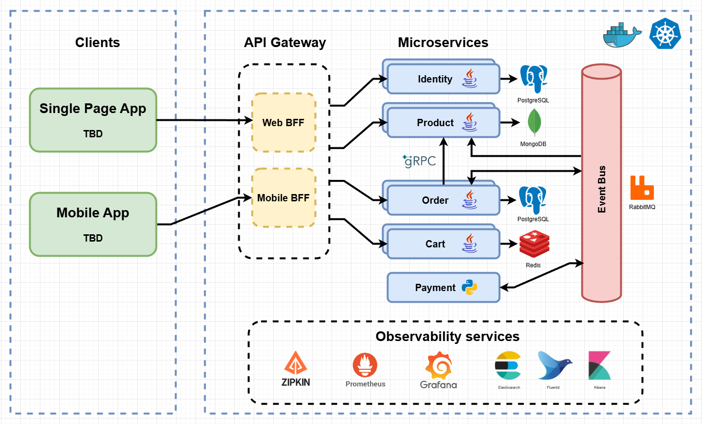
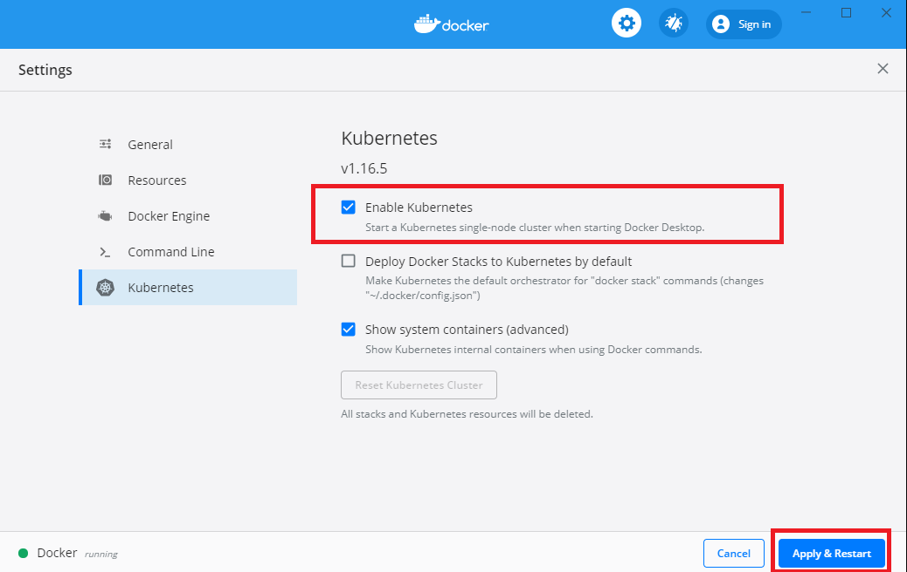

# eShopOnSteroids

[](https://github.com/badass-techie/eShopOnSteroids/actions/workflows/build-and-push-docker-images.yml) [](https://github.com/badass-techie/eShopOnSteroids/issues) [](https://github.com/badass-techie/eShopOnSteroids/pulls)  

eShopOnSteroids is a well-architected, distributed, event-driven, cloud-first e-commerce platform powered by the following building blocks of microservices:

1. API Gateway (Spring Cloud Gateway)
2. Service Discovery (HashiCorp Consul)
3. Distributed Tracing (Sleuth, Zipkin)
4. Circuit Breaker (Resilience4j)
5. Message Bus (RabbitMQ)
6. Database per Microservice (PostgreSQL, MongoDB, Redis)
7. Centralized Monitoring (Prometheus, Grafana)
8. Control Loop (Kubernetes, Terraform)

This code follows best practices such as:

- Unit Testing (JUnit 5, Mockito, Pytest)
- Integration Testing (Testcontainers)
- Design Patterns (Builder, Singleton, PubSub, ...)

> microservices, event-driven, distributed systems, e-commerce, domain-driven-design, java, python, spring cloud, spring boot, spring cloud gateway, hashicorp consul, hashicorp vault, spring cloud sleuth, zipkin, resilience4j, postgresql, mongodb, redis, cache, kubernetes, k8s, prometheus, grafana, rabbitmq, terraform

Note: If you are interested in this project, no better way to show it than ★ starring the repository!

## Architecture

The architecture proposes a microservices oriented implementation where each microservice is responsible for a single business capability. The microservices are deployed in a containerized environment (Docker) and orchestrated by a control loop (Kubernetes) which continuously compares the state of each microservice to the desired state, and takes necessary actions to arrive at the desired state.

Each microservice stores its data in its own database tailored to its requirements, such as an In-Memory Database for a shopping cart whose persistence is short-lived, a Document Database for a product catalog for its flexibility, or a Relational Database for an order management system for its ACID properties.

Microservices communicate externally via REST through a secured API Gateway, and internally via

- gRPC for synchronous communication which excels for its performance
- a message bus for asynchronous communication in which the receiving microservice is free to handle the message whenever it has the capacity

Below is a visual representation:



- All microservices are inside a private network and not accessible except through the API Gateway.
- The API Gateway routes requests to the appropriate microservice, and validates the authorization of requests to all microservices except the Identity Microservice.
- The Identity Microservice acts as an Identity Issuer and is responsible for storing users and their roles, and for issuing authorization credentials.
- All microservices send regular heartbeats to the Discovery Server which helps them locate each other as they may have multiple instances running hence different IP addresses.
- The Cart Microservice manages the shopping cart of each user. It uses a cache (Redis) as the storage.
- The Product Microservice stores the product catalog and stock. It's subscribed to the Message Bus to receive notifications of new orders and update the stock accordingly.
- The Order Microservice manages order processing and fulfillment. It performs a gRPC call to the Product Microservice to check the availability and pricing of the products in the order pre-checkout, and publishes messages to the Message Bus to initiate a payment and to update the stock post-checkout.
- The gRPC communication between the microservices is fault-tolerant thanks to a circuit breaker.
- The Payment Microservice handles payment processing. It's subscribed to the Message Bus to receive notifications of new orders and initiate a payment. It does not sit behind the API Gateway as it is not directly accessible by the user. It is also stateless and does not store any data.

Admin services include:

- Consul dashboard to monitor the availability and health of microservices

- Zipkin dashboard for tracing requests across microservices

- Grafana dashboard for visualizing the metrics of microservices and setting up alerts for when a metric exceeds a threshold


## Setup

### Prerequisites

- [Docker](https://docs.docker.com/get-docker/)

Yes, that's it!

### Development

1. Create the env file and fill in the missing values

    ```bash
    cp .env.example .env
    vi .env
    ...
    ```

2. Start the containers

    ```bash
    docker compose -f docker-compose.dev.yml up
    ```

    The first time you run this command, it will take a few minutes to build the images, after which you should be able to access the application at port 8080 locally. Changes to the source code will be automatically reflected in the containers without any extra steps.

    To stop the containers, run:

    ```bash
    docker compose -f docker-compose.dev.yml down
    ```

    To remove saved data along with the containers, run the following command:

    ```bash
    docker compose -f docker-compose.dev.yml down -v
    ```

### Production

#### Deploy containers with docker compose

1. Create the env file and fill in the missing values

    ```bash
    cp .env.example .env
    vi .env
    ...
    ```

    Then:

2. (Optional) Run the following command to build the images locally:

    ```bash
    docker compose build
    ```

    It will take a few minutes. Alternatively, you can skip this step and the images will be pulled from Docker Hub.

3. Start the containers

    ```bash
    docker compose up
    ```

You can now access the application at port 8080 locally

#### Deploy to local Kubernetes cluster

1. Ensure you have enabled Kubernetes in Docker Desktop as below:

    

    (or alternatively, install [Minikube](https://minikube.sigs.k8s.io/docs/start/) and start it with `minikube start`)

    Then:

2. Enter the directory containing the Kubernetes manifests

    ```bash
    cd k8s
    ```

3. Create the env file and fill in the missing values

    ```bash
    cp ./config/.env.example ./config/.env
    vi ./config/.env
    ...
    ```

4. Create the namespace

    ```bash
    kubectl apply -f ./namespace
    ```

5. Change the context to the namespace

    ```bash
    kubectl config set-context --current --namespace=eshoponsteroids
    ```

6. Create Kubernetes secrets from the env file

    ```bash
    kubectl create secret generic env-secrets --from-env-file=./config/.env
    ```

7. Apply the configmaps

    ```bash
    kubectl apply -f ./config
    ```

8. Install kubernetes metrics server (needed to scale microservices based on metrics)

    ```bash
    kubectl apply -f https://github.com/kubernetes-sigs/metrics-server/releases/latest/download/components.yaml
    ```

9. Deploy the containers

    ```bash
    kubectl apply -f ./deployments
    ```

10. Expose the API gateway and admin services

    ```bash
    kubectl apply -f ./networking/node-port.yml
    ```

You can now access the application at port 30080 locally

To tear everything down, run the following command:

```bash
kubectl delete namespace eshoponsteroids
```

Future work:

- Simplify the deployment process by templating similar manifests with Helm
- Overlay/patch manifests to tailor them to different environments (dev, staging, prod, ...) using Kustomize

#### Deploy to AWS EKS cluster

Typically, DevOps engineers provision cloud resources, and developers only focus on deploying code to these resources. However, as a developer, to be able to design cloud-native applications such as this one, it's important to understand the basics of the infrastructure on which your code runs. That is why we will provision our own Kubernetes cluster on AWS EKS (Elastic Kubernetes Service) for our application.

For this section, in addition to Docker you will need:

- Basic knowledge of the AWS platform
- An AWS account
- AWS CLI configured with the credentials of either your account or an IAM user with administrator access (run `aws configure`)

Here is a breakdown of the resources we will provision:

- VPC (Virtual Private Cloud): a virtual network where our cluster will reside
- Subnets: 2 public and 2 private subnets in different availability zones (required by EKS to ensure high availability of the cluster)
- Internet Gateway: allows external access to our VPC
- NAT Gateway: allows our private subnets to access the internet
- Security Groups: for controlling inbound and outbound traffic to our cluster
- IAM Roles: for granting permissions to our cluster to access other AWS services and perform actions on our behalf
- EKS Cluster: the Kubernetes cluster itself
- EKS Node Group: the worker nodes that will run our containers

To provision the cluster, we will use Terraform as opposed to AWS Console or eksctl. [What is Terraform and how does it simplify infrastructure management?](https://www.ibm.com/topics/terraform) All the above resources are already defined as terraform manifests and what is left to do is to apply them to our AWS account.

Thus far we have applied the approach used by Terraform to create and manage resources (called a declarative approach) in Docker Compose and Kubernetes. Its main advantage is that it is reusable and always yields the same results.

Let us start by installing Terraform (if you haven't already):

Windows (20H2 or later):

```bash
winget install HashiCorp.Terraform
```

Mac:

```bash
brew tap hashicorp/tap
brew install hashicorp/tap/terraform
```

Linux:

```bash
curl -O https://releases.hashicorp.com/terraform/1.6.2/terraform_1.6.2_linux_amd64.zip
unzip terraform_*_linux_amd64.zip
sudo mv terraform /usr/local/bin/
terraform -v    # verify installation
```

Then:

1. Enter the directory containing the terraform manifests

    ```bash
    cd terraform
    ```

2. Initialize Terraform

    ```bash
    terraform init
    ```

    This step downloads the required providers (AWS, Kubernetes, Helm, ...) and plugins.

3. Generate an execution plan to see what resources will be created

    ```bash
    terraform plan -out=tfplan
    ```

4. Apply the execution plan

    ```bash
    terraform apply tfplan
    ```

    This step will take approximately 15 minutes. You can monitor the progress in the AWS Console.

5. Configure kubectl to connect to the cluster

    ```bash
    aws eks update-kubeconfig --region us-east-1 --name eshoponsteroids
    ```

6. Verify that the cluster is up and running

    ```bash
    kubectl get nodes
    ```

    The output should be similar to:

    ```bash
    NAME                                      STATUS   ROLES    AGE   VERSION
    ip-10-0-8-72.us-east-1.compute.internal   Ready    <none>   10m   v1.28.1-eks-55daa9d
    ```

Let us now deploy our application to the cluster:

1. Go back to the root directory of the project

    ```bash
    cd ..
    ```

2. Execute steps 2 to 9 of [Deploy to local Kubernetes cluster](#deploy-to-local-kubernetes-cluster).

3. Run `kubectl get deployments --watch` and `kubectl get statefulsets --watch` to monitor the progress.

4. Request a load balancer from AWS to expose the application's API gateway outside the cluster once deployments are ready

    ```bash
    kubectl apply -f ./networking/load-balancer.yml
    ```

    Run `kubectl get svc | grep LoadBalancer` to get the load balancer's address. It should be similar to:

    ```bash
    load-balancer      LoadBalancer   172.20.131.96    a890f7fb3c6da8536b7dbdbdf3281d23-94553621.us-east-1.elb.amazonaws.com   8080:31853/TCP,8500:32310/TCP,9411:30272/TCP,9090:32144/TCP,3000:31492/TCP   60s
    ```

    The fourth column is the load balancer's address. Go to the AWS EC2 Console's Load Balancer feature and verify that the load balancer has been created. 

You can now access the application at port 8080 with the hostname as the load balancer's address. You can also access the admin services with their respective ports.

To tear down the infrastructure, run the following commands:

```bash
kubectl delete namespace eshoponsteroids
terraform destroy
```

Remember to Change the context of kubectl back to your local cluster if you have one:

```bash
kubectl config get-contexts
kubectl config delete-context [name-of-remote-cluster]
kubectl config use-context [name-of-local-cluster]
```

Future work:

- Add AWS EKS CSI driver to terraform which will allow provisioning of AWS EBS volumes for Kubernetes PVCs
- Use an Ingress Controller (e.g. Nginx) instead of a Load Balancer to expose the API Gateway outside the cluster

## Usage

The interface (a Single-Page Application) is still a work in progress, but the available endpoints can be found in the API documentation which post-deployment can be accessed at:

- http://[host]:[port]/api/v1/[name-of-microservice]/swagger-ui.html


## Testing

First, enter the container of the microservice you want to test:

```bash
docker exec -it [container-id] bash
```

For example:

```bash
docker exec -it eshoponsteroids-cart-1 bash
```

### Unit tests

To run Java unit tests, run the following command:

```bash
mvn test
```

To run Python unit tests, run the following command:

```bash
pytest
```

### Integration tests

- Make sure you have Docker installed and running
- Run the following command in your local system (not the containers):

```bash
mvnw verify
```

## Third Party Integrations

- [Stripe](https://stripe.com/) for credit and debit card payments
- [Daraja](https://developer.safaricom.co.ke/) for M-Pesa payments (M-Pesa is a mobile money service in Kenya)
- [Africa's Talking](https://africastalking.com/) for SMS notifications (WIP)
